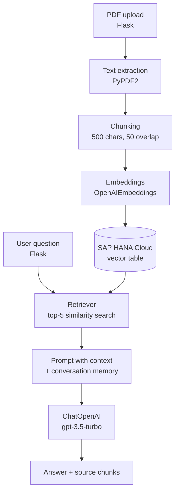

# SAP HANA VectorDB RAG

Retrieval-Augmented Generation on **SAP HANA Cloud vector capabilities**: upload PDFs, embed them into a HANA vector table, and chat with them through a small web app.

> Status: an exploratory prototype, not a production system. See [Limitations](#limitations).

## Overview

Two small Flask apps share one HANA vector table (`UPLOAD_DOCUMENT_VECTORS`):

| App | Folder | What it does |
|---|---|---|
| Ingestion | `python-hanavector-rag-upload/` | Upload a PDF, split it into chunks, embed them and store them in HANA |
| Question answering | `python-hanavector-rag/` | Ask a question; retrieve the 5 most similar chunks from HANA and answer with an LLM |

## Architecture



### What SAP HANA does here

- **Vector storage:** embeddings are kept in a HANA table through LangChain's `HanaDB` vector store.
- **Similarity search:** the retriever queries HANA for the nearest chunks (`k=5`).
- **Metadata:** each chunk is stored with its source file name and chunk index.

## RAG pipeline as implemented

1. **Ingest** (`upload-to-hana-vectordb.py`): PDF only, max 16 MB. Text is read with PyPDF2 and split with `RecursiveCharacterTextSplitter` (`chunk_size=500`, `chunk_overlap=50`). Chunks are embedded with OpenAI embeddings and written to HANA with `{"source": filename, "chunk": i}` metadata. The uploaded file is deleted afterwards.
2. **Retrieve and generate** (`hanaragapp.py`): a LangChain `ConversationalRetrievalChain` retrieves the top 5 chunks from HANA, fills a prompt template and calls `gpt-3.5-turbo`. A conversation buffer keeps chat history. The source documents are returned to the page.

## Technology stack

Python 3.12, Flask, LangChain (`langchain`, `langchain-community`, `langchain-openai`), SAP HANA Cloud (`hdbcli`), OpenAI API, PyPDF2. Each app includes a Cloud Foundry `manifest.yml` for deployment (for example on SAP BTP).

## Setup

Prerequisites: a SAP HANA Cloud instance with the vector engine available, and an OpenAI API key.

```bash
cd python-hanavector-rag          # or python-hanavector-rag-upload
pip install -r requirements.txt
```

### Configuration

Create a `.env` file (never commit it):

```
OPENAI_API_KEY=...
HANA_USER=...
HANA_PASSWORD=...
```

The HANA host is currently hard-coded as a placeholder address in the Python files (`dbapi.connect(address=...)`). Replace it with your own instance before running.

## Usage

```bash
# 1. Load documents
cd python-hanavector-rag-upload
python upload-to-hana-vectordb.py     # open the page, upload a PDF

# 2. Ask questions
cd ../python-hanavector-rag
python hanaragapp.py                  # open the page, type a question
```

Both apps default to port 4000 (override with `PORT`).

## Limitations

- No evaluation of retrieval or answer quality, and no latency measurements.
- The answer prompt still contains tutorial wording ("expert in state of the union topics") and should be rewritten for your documents.
- PDF text only; no OCR, tables or other formats.
- The HANA host is hard-coded, `manifest.yml` environment values are placeholders, TLS certificate validation is disabled (`sslValidateCertificate=False`) and Flask runs with `debug=True`. Fix these before any real use.
- Fixed model choices (`gpt-3.5-turbo`, OpenAI embeddings).

## Where this pattern applies

Enterprise document search, technical knowledge assistants over product or SAP documentation, internal knowledge bases and domain-specific assistants. This repo demonstrates the building blocks only.

## Roadmap

- Parameterise the HANA connection and prompt.
- Add retrieval and answer-quality evaluation.
- Add support for more document types.
